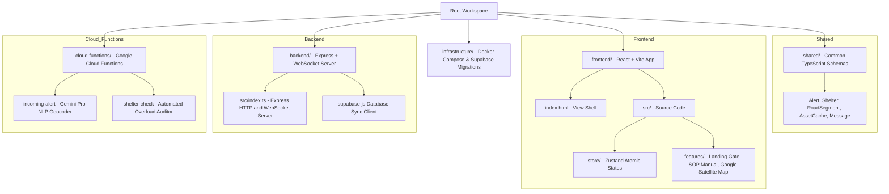

# 🛰️ BEACON: Real-Time Tactical Disaster Telemetry Hub

**Beacon** is a real-time, cyberpunk-aesthetic disaster response operations center dashboard designed for incident command teams. Formulated for scenario coordination during **Hurricane Elena (24h Post-Landfall)** in Houston, TX, it integrates live geographic telemetry, autonomous alert feeds, and an AI-driven disaster coordination copilot.

---

## 🏗️ Technical Architecture Map

The project is structured as a clean multi-service monorepo using `pnpm` workspaces:



---

## ⚡ Implemented Features (Monorepo Progress)

### 🧬 Cyberpunk Onboarding Landing Gate
- **Tactical Access**: Responders are met with an authentication gate displaying active system metrics (Standby telemetry, AI linkage stats, and current Sector coordinates).
- **Sound Synthesis**: Clicking "Initialize Command Core" triggers a terminal-style initialization log paired with a Web Audio API audio low-pass filter sweeper and confirmation chime.
- See: [LandingPage.tsx](file:///c:/Users/user/Desktop/google-hackathon/frontend/src/features/landing/LandingPage.tsx)

### 🗺️ Live Google Maps & Basemaps Switcher
- **Google Satellite View**: The map operation panel supports toggling onto **Google Satellite Hybrid** maps, enabling responders to inspect real houses, roads, and buildings during simulations.
- **Tactical Dark Mode**: Default style leveraging CartoDB Dark Matter tiles, ideal for neon glowing overlays.
- **Basemap Key Reloading**: Dynamically changes React keys to reload the tile grid instantly when the basemap style changes.
- See: [MapView.tsx](file:///c:/Users/user/Desktop/google-hackathon/frontend/src/features/map-view/MapView.tsx)

### 🌀 Animated Hurricane Weather Radar
- **Precipitation Bands**: Renders radial precipitation rings centered in the Gulf of Mexico (Galveston/Houston area).
- **GPU-Accelerated Sweep**: Driven by custom CSS keyframe animations, the storm bands sweep clockwise and counter-clockwise to simulate live weather feeds.
- See: [index.css](file:///c:/Users/user/Desktop/google-hackathon/frontend/src/index.css)

### 📂 Interactive Q&A SOP Manual Sidebar
- **Operations Accordion**: Provides standard operating procedures for critical incidents (e.g. GRB Shelter overload, I-10 bypass routing, low medical stockpiles).
- **Ask Copilot Interception**: Clicking "Ask Copilot" on any SOP item directly inputs the corresponding query into the AI Coordination panel, initiating a simulated thinking log and tool execution.
- See: [SOPManual.tsx](file:///c:/Users/user/Desktop/google-hackathon/frontend/src/features/qa/SOPManual.tsx)

### 🎛️ Settings Drawer & Simulation Controls
- Slide-over control deck to trigger pre-configured incidents, customize AI stream delays, adjust coordinates, or inject custom events.
- See: [AdminControls.tsx](file:///c:/Users/user/Desktop/google-hackathon/frontend/src/features/admin/AdminControls.tsx)

### 🗂️ Shared Types Workspace (`beacon-shared`)
- Centrally exports standard TypeScript type interfaces and schemas (such as `Alert`, `Shelter`, `RoadSegment`, `AssetCache`, and `Message`).
- Shared directly via workspace symlinks to both the frontend and backend compilation engines.
- See: [shared/src/index.ts](file:///c:/Users/user/Desktop/google-hackathon/shared/src/index.ts)

### 📡 Express & WebSocket Server Backend (`beacon-backend`)
- Implements a hybrid Node server starting Express endpoints and WebSockets on port `4000`.
- Broadcasts incoming alerts to all connected dispatch monitors in real-time over WebSocket connections.
- Persists telemetry directly to Supabase PostgreSQL when credentials are set up.
- See: [backend/src/index.ts](file:///c:/Users/user/Desktop/google-hackathon/backend/src/index.ts)

### ☁️ Serverless Google Cloud Functions (`beacon-cloud-functions`)
- **processIncomingAlert (HTTP target)**: Uses **Gemini Pro** (`gemini-pro`) to automatically parse unstructured text field messages, geocode location references, classify severities, and insert them into Supabase. See: [incoming-alert.ts](file:///c:/Users/user/Desktop/google-hackathon/cloud-functions/src/incoming-alert.ts)
- **checkShelterCapacity (audit target)**: Audits active shelters in Supabase. Shifts full shelters to `critical` status and publishes automated redirect warnings on the alerts timeline. See: [shelter-check.ts](file:///c:/Users/user/Desktop/google-hackathon/cloud-functions/src/shelter-check.ts)

### 🐳 Database Docker Compose & Supabase Schemas
- **Supabase Postgres Script**: A SQL file setting up all disaster coordinate tables, enums, triggers, and Row-Level Security (RLS) policies along with seed records for Houston shelters and road segments. See: [schema.sql](file:///c:/Users/user/Desktop/google-hackathon/infrastructure/supabase/schema.sql)
- **Docker Compose Orchestrator**: Starts local PostgreSQL (automatically initialized with `schema.sql`) and MongoDB container databases to run local offline development environments. See: [docker-compose.yml](file:///c:/Users/user/Desktop/google-hackathon/infrastructure/docker-compose.yml)

---

## 🚀 Get Started Quick

### 1. Installation
Clone the repository and install packages from the root directory:
```bash
# Install all workspace dependencies and link modules
pnpm install
```

### 2. Launch Local Database Containers (Optional)
If you want to run database containers locally (simulating Supabase Postgres and MongoDB Atlas):
```bash
cd infrastructure
docker compose up -d
cd ..
```

### 3. Configure Environments
- Create `/backend/.env` copying `/backend/.env.example`.
- Create `/cloud-functions/.env` copying `/cloud-functions/.env.example`.
Update with your Supabase URL/API keys and Gemini API key.

### 4. Running the Applications
Run development servers concurrently in separate terminals:
```bash
# Starts the Frontend UI (port 5173)
pnpm dev:frontend

# Starts the Backend Server (port 4000)
pnpm dev:backend

# Starts the processIncomingAlert GCF Webhook runtime (port 8080)
pnpm dev:functions:alert

# Starts the checkShelterCapacity GCF Monitor runtime (port 8081)
pnpm dev:functions:shelter
```

### 5. Running Validation Gates
Verify TypeScript compilation and packaging across the entire monorepo:
```bash
# Run TypeScript typecheck on all workspaces
pnpm typecheck

# Run production compilation and bundling
pnpm build
```

---

## 📋 Implementation Backlog (What Needs to Be Done)

If you are cloning this project to build out the next phase, here is what is required:

- `[ ]` **MongoDB Atlas archiving**: Add logs streaming to save telemetry cache segments in MongoDB Atlas for command post forensic analysis.
- `[ ]` **Deployments**: Configure Terraform scripts to deploy database tables and host the node backend in cloud container registries.

For deep-dive architecture details, check out the [Technical Architecture Guide](file:///c:/Users/user/Desktop/google-hackathon/TECHNICAL_GUIDE.md).
