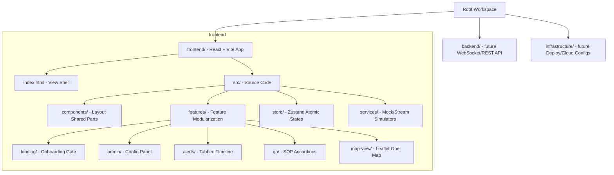

# 🛰️ BEACON: Real-Time Tactical Disaster Telemetry Hub

**Beacon** is a real-time, cyberpunk-aesthetic disaster response operations center dashboard designed for incident command teams. Formulated for scenario coordination during **Hurricane Elena (24h Post-Landfall)** in Houston, TX, it integrates live geographic telemetry, autonomous alert feeds, and an AI-driven disaster coordination copilot.

---

## 🏗️ Technical Architecture Map

The project is structured as a clean multi-service monorepo using `pnpm` workspaces:



---

## ⚡ Implemented Features (Operational Progress)

### 🧬 Cyberpunk Onboarding Landing Gate
- **Tactical Access**: Responders are met with an authentication gate displaying active system metrics (Standby telemetry, AI linkage stats, and current Sector coordinates).
- **Sound Synthesis**: Clicking "Initialize Command Core" triggers a terminal-style initialization log paired with a Web Audio API audio low-pass filter sweeper and confirmation chime.
- See: [LandingPage.tsx](file:///c:/Users/user/Desktop/google-hackathon/frontend/src/features/landing/LandingPage.tsx)

### 🗺️ Live Google Maps & basemaps switcher
- **Google Satellite View**: The map operation panel supports toggling onto **Google Satellite Hybrid** maps, enabling responders to inspect real houses, roads, and buildings during simulations.
- **Tactical Dark Mode**: Default style leveraging CartoDB Dark Matter tiles, ideal for neon glowing overlays.
- **Basemap Key Reloading**: Dynamically changes React keys to reload the tile grid instantly when the basemap style changes.
- See: [MapView.tsx](file:///c:/Users/user/Desktop/google-hackathon/frontend/src/features/map-view/MapView.tsx)

### 🌀 Animated Hurricane Weather Radar
- **Precipitation Bands**: Renders radial precipitation rings centered in the Gulf of Mexico (Galveston/Houston area).
- **GPU-Accelerated Sweep**: Driven by custom CSS keyframe animations, the storm bands sweep clockwise and counter-clockwise to simulate live weather feeds.
- See: [index.css](file:///c:/Users/user/Desktop/google-hackathon/frontend/src/index.css)

### 📂 Interactive Q&A SOP Manual Sidebar
- **Operations Accordion**: Provides standard operating procedures for critical incidents (e.g. GRB Shelter overload, I-10 bypass routing, low medical stockpiles).
- **Ask Copilot Interception**: Clicking "Ask Copilot" on any SOP item directly inputs the corresponding query into the AI Coordination panel, initiating a simulated thinking log and tool execution.
- See: [SOPManual.tsx](file:///c:/Users/user/Desktop/google-hackathon/frontend/src/features/qa/SOPManual.tsx)

### 🎛️ Settings Drawer & Simulation Controls
- Slide-over control deck to trigger pre-configured incidents, customize AI stream delays, adjust coordinates, or inject custom events.
- See: [AdminControls.tsx](file:///c:/Users/user/Desktop/google-hackathon/frontend/src/features/admin/AdminControls.tsx)

---

## 🚀 Get Started Quick

### 1. Installation
Clone the repository and install packages from the root directory:
```bash
# Install all workspace dependencies
pnpm install
```

> [!NOTE]
> On Windows systems, hot reloading might lock Tailwind oxide binaries. If a global `pnpm install` throws EPERM errors, navigate into the frontend package and run:
> `cd frontend && pnpm install --ignore-workspace`

### 2. Run Development Server
```bash
# Start the Vite dev server for the frontend
pnpm --filter beacon-frontend dev
```

### 3. Verification Gates
Verify TypeScript compilation and packaging:
```bash
# Run TypeScript compilation checks
pnpm --filter beacon-frontend typecheck

# Run production bundling
pnpm --filter beacon-frontend build
```

---

## 📋 Implementation Backlog (What Needs to Be Done)

If you are cloning this project to build out the next phase, here is what is required:

- `[ ]` **Shared Types Package (`/shared`)**: Extract typescript interface schemas into the `/shared` workspace package to share structures between frontend and backend.
- `[ ]` **WebSockets Service (`/backend`)**: Replace mock simulated streams under [mockData.ts](file:///c:/Users/user/Desktop/google-hackathon/frontend/src/services/mockData.ts) with active WebSockets connected to a real node/python server for live multi-responder coordination.
- `[ ]` **Cloud Functions (`/cloud-functions`)**: Build serverless trigger webhooks to process incoming citizen calls and automatically categorize alert severities using LLM endpoints.
- `[ ]` **Infrastructure Configuration (`/infrastructure`)**: Write Terraform/Docker Compose scripts to automate local cluster orchestration and Cloud staging deployments.

For deep-dive architecture details, check out the [Technical Architecture Guide](file:///c:/Users/user/Desktop/google-hackathon/TECHNICAL_GUIDE.md).
